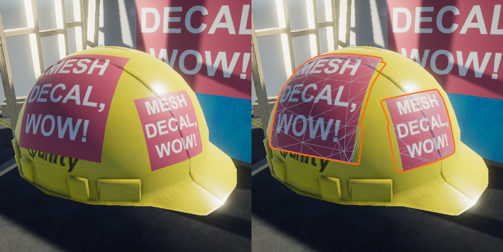

# MeshDecal
A simple mesh decal component for Unity. The project uses URP but the component works in any version of Unity.
Because the resulting decal is just a mesh, it will work with any material in any render pipeline.
To install in another project, just copy the Assets/MeshDecal/ directory to your own assets folder.

# Info
I recommend using a shader with a depth offset, but if you can't do that, you can offset the actual mesh via a slider on the component.  
The mesh is serialized by storing the mesh data in lists and is rebuilt on enabling. This means the decal does not need to recompute at runtime. If you wish to do so however, uncheck "Serialize" and call Recalculate() whenever you want to update the decal.

# Limitations
Only supports a single mesh (although it does support submeshes). Supports SkinnedMeshRenderers but the resulting decal is not skinned.
